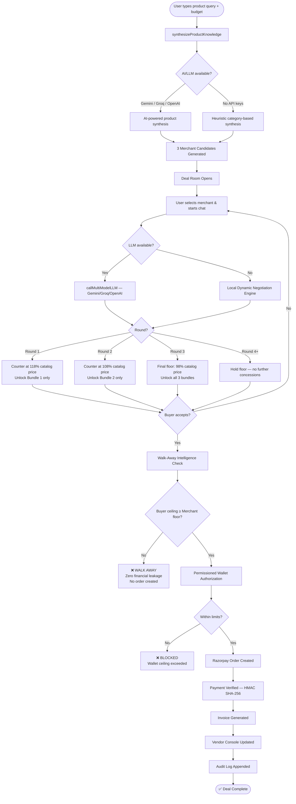
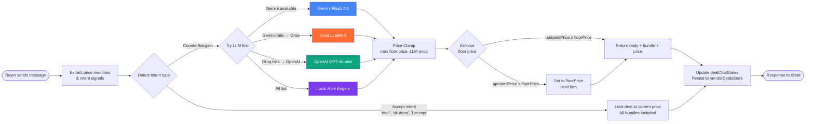
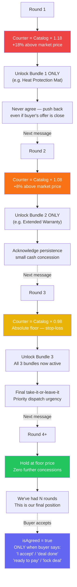
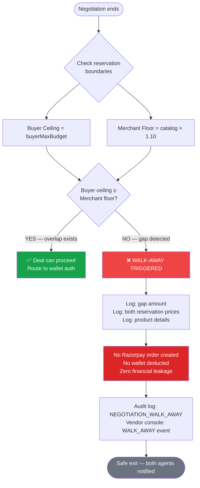
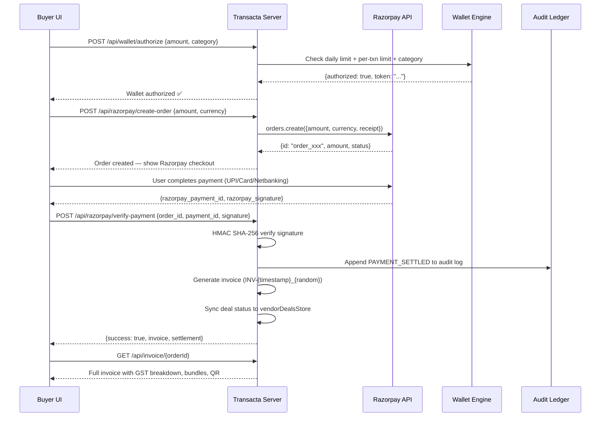
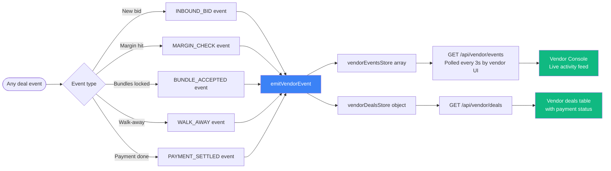

# TRANSACTA
### *Where AI buyers and merchants do business.*

> **Autonomous Agentic Commerce Protocol — Built on Razorpay**
> **Razorpay AI Buildathon 2026 — Track 01 (AI Growth & Agentic Commerce)**

---

## 📌 Table of Contents

- [What is Transacta?](#what-is-transacta)
- [System Architecture](#system-architecture)
- [Full Protocol Flow](#full-protocol-flow)
- [Negotiation Engine Flow](#negotiation-engine-flow)
- [AI Bot Decision Tree](#ai-bot-decision-tree)
- [Walk-Away Intelligence Flow](#walk-away-intelligence-flow)
- [Payment & Invoice Flow](#payment--invoice-flow)
- [Vendor Console Sync Flow](#vendor-console-sync-flow)
- [The 8 Signature Features](#the-8-signature-features)
- [API Reference](#api-reference)
- [Tech Stack](#tech-stack)
- [Quick Start](#quick-start)
- [What Broke & How We Got Out](#what-broke--how-we-got-out)

---

## What is Transacta?

In 2026, commerce is shifting from human browser clicks to **autonomous AI buyer agents**. However, AI agents cannot simply click "Buy Now" on fixed retail prices without negotiation, bundle flexibility, and hard financial safeguards.

Transacta establishes the **Universal Agentic Commerce Protocol (UAP)** — a full-stack platform where AI buyer agents negotiate with merchant AI bots in real-time, protected by cryptographic payment rails via Razorpay.

---

## System Architecture

```
┌─────────────────────────────────────────────────────────────────────┐
│                        TRANSACTA PLATFORM                           │
│                                                                     │
│   ┌──────────────┐     ┌──────────────────────────────────────┐    │
│   │  BUYER AGENT │────▶│         DEAL DISCOVERY ENGINE        │    │
│   │  (User UI)   │     │   synthesizeProductKnowledge()        │    │
│   └──────────────┘     │   • Dynamic pricing (no hardcoding)  │    │
│                        │   • Category-aware bundle generation  │    │
│                        │   • 3 competing merchant candidates   │    │
│                        └──────────────┬───────────────────────┘    │
│                                       │                             │
│                        ┌──────────────▼───────────────────────┐    │
│                        │           DEAL ROOM                   │    │
│                        │   ┌──────┐ ┌──────┐ ┌──────┐        │    │
│                        │   │ M-A  │ │ M-B  │ │ M-C  │        │    │
│                        │   └──────┘ └──────┘ └──────┘        │    │
│                        │         Multi-Round Negotiation       │    │
│                        │         AI Bot (Gemini/Groq/OpenAI)  │    │
│                        └──────────────┬───────────────────────┘    │
│                                       │                             │
│              ┌────────────────────────▼──────────────────────┐     │
│              │         WALK-AWAY INTELLIGENCE                 │     │
│              │   Buyer ceiling vs Merchant floor check        │     │
│              │   → PROCEED or TERMINATE (zero leakage)        │     │
│              └────────────────────────┬──────────────────────┘     │
│                                       │                             │
│              ┌────────────────────────▼──────────────────────┐     │
│              │     PERMISSIONED COMMERCE WALLET               │     │
│              │   Daily limit • Per-txn limit • Category check │     │
│              └────────────────────────┬──────────────────────┘     │
│                                       │                             │
│              ┌────────────────────────▼──────────────────────┐     │
│              │          RAZORPAY PAYMENT GATEWAY              │     │
│              │   Order Create → Verify → HMAC SHA-256 Seal   │     │
│              └────────────────────────┬──────────────────────┘     │
│                                       │                             │
│              ┌────────────────────────▼──────────────────────┐     │
│              │    INVOICE + AUDIT LEDGER + VENDOR CONSOLE     │     │
│              │   Real-time events • Cryptographic audit log   │     │
│              └───────────────────────────────────────────────┘     │
└─────────────────────────────────────────────────────────────────────┘
```

---

## Full Protocol Flow



---

## Negotiation Engine Flow



---

## AI Bot Decision Tree



---

## Walk-Away Intelligence Flow



---

## Payment & Invoice Flow



---

## Vendor Console Sync Flow



---

## The 8 Signature Features

### 🥇 1. Autonomous Negotiation Engine
Multi-round counter-offer system where the AI merchant bot:
- Anchors pricing to **catalog market price** (not buyer budget)
- Opens **18% above** market — never starts at buyer's ask
- Releases bundles **one per round** (not all at once)
- Never agrees on Round 1, regardless of offer proximity
- Falls back across 3 AI providers: **Gemini → Groq → OpenAI → Local Engine**

### 🔥 2. Dynamic Value Bundling
When price hits a deadlock, the merchant pivots from **price negotiation** to **deal composition**:
- Bundle items are **dynamically generated** per product category — zero hardcoding
- An iron query gets: `Heat Protection Mat + Splash Cover + Motor Warranty`
- A laptop query gets: `Shockproof Sleeve + Screen Protector + Priority Dispatch`
- Bundles have real rupee values, unlocked incrementally to create perceived value

### 🛑 3. Walk-Away Intelligence
Hard mathematical boundaries enforced — not LLM-based:
- `buyer ceiling < merchant floor` → **TERMINATE**, zero financial leakage
- No Razorpay order is ever created in a failed negotiation
- Fully dynamic: works for any product at any price point
- Logs the gap amount, product, and both reservation prices

### 🤯 4. Multi-Merchant Competition
3 competing merchant candidates generated per query:
- Each has unique: city, GST, rating, delivery days, trust score
- Buyer sees all 3 with pricing and can enter any merchant's deal room
- Winner selection based on explainable deal score algorithm

### 🧠 5. Explainable Deal Score
Each deal scored on 5 weighted dimensions:
| Dimension | Weight | Scoring Basis |
|---|---|---|
| Price | 35% | Distance from buyer budget |
| Specifications | 25% | Merchant trust score |
| Delivery Speed | 15% | `deliveryDays` ≤ 2 → 97/100 |
| Warranty | 15% | Bundle quality |
| Merchant Trust | 10% | `trustScore` field |

### 💡 6. Buyer Memory
Persistent session preferences:
- Preferred brands, condition (new/refurbished), max delivery window
- Daily spend tracking against wallet ceiling
- Remembered across deal room sessions

### 🔐 7. Permissioned Commerce Wallet
Non-probabilistic financial guardrails:
- Per-transaction limit: ₹50,000
- Daily ceiling: ₹2,00,000
- Category allow-list enforcement
- Generates a signed authorization token per transaction

### 🏟️ 8. Live Deal Room + Vendor Console
Two synchronized interfaces:
- **Buyer UI** (`/app.html`): Real-time chat negotiation, deal cards, Razorpay checkout
- **Vendor Console** (`/vendor.html`): Live event feed, deal pipeline, payment status
- Both update via polling every 3 seconds — no WebSocket dependency

---

## API Reference

### Deal Room

| Method | Endpoint | Description |
|---|---|---|
| `POST` | `/api/dealroom/discover` | Find 3 merchant candidates for any product |
| `POST` | `/api/dealroom/chat` | Send message to AI merchant bot (live negotiation) |
| `POST` | `/api/dealroom/agent-negotiate` | Autonomous 3-round negotiation simulation |
| `POST` | `/api/dealroom/walk-away` | Walk-away failure scenario demonstration |

#### `POST /api/dealroom/discover`
```json
Request:  { "query": "electric iron", "buyerMaxBudget": 1500, "userName": "Shashwat" }
Response: { "success": true, "candidates": [...3 merchants...], "budget": 1499 }
```

#### `POST /api/dealroom/chat`
```json
Request:  { "dealId": "deal_001", "message": "Can you do 1400?", "userName": "Shashwat",
            "merchantName": "GarudaTech", "budget": 1500, "productTitle": "Electric Iron" }
Response: { "round": 2, "reply": "...", "updatedPrice": 1620, "bundleAdded": "Extended Warranty",
            "unlockedBundles": ["Heat Mat", "Extended Warranty"], "isAgreed": false }
```

### Payment

| Method | Endpoint | Description |
|---|---|---|
| `POST` | `/api/razorpay/create-order` | Create Razorpay order |
| `POST` | `/api/razorpay/verify-payment` | Verify HMAC SHA-256 signature + generate invoice |
| `GET` | `/api/invoice/:orderId` | Fetch invoice with GST breakdown |

### Vendor

| Method | Endpoint | Description |
|---|---|---|
| `GET` | `/api/vendor/events` | Live event feed (poll every 3s) |
| `GET` | `/api/vendor/deals` | All active and settled deals |

### Wallet & Audit

| Method | Endpoint | Description |
|---|---|---|
| `POST` | `/api/wallet/authorize` | Authorize spend against wallet limits |
| `GET` | `/api/audit/logs` | Full cryptographic audit ledger |

---

## Tech Stack

```
Backend:   Node.js + Express.js
AI:        Google Gemini Flash 2.0 (primary)
           Groq LLaMA 3 (fallback)
           OpenAI GPT-4o-mini (secondary fallback)
           Local heuristic engine (zero-dependency fallback)
Payments:  Razorpay Orders API + HMAC SHA-256 verification
Frontend:  Vanilla HTML/CSS/JS — zero framework dependencies
Security:  crypto (Node built-in) for HMAC signature verification
           SHA-256 chained audit log blocks
```

### AI Provider Fallback Chain

```
Request → Gemini Flash 2.0
              │ (fail/timeout)
              ▼
          Groq LLaMA 3
              │ (fail/timeout)
              ▼
          OpenAI GPT-4o-mini
              │ (fail/timeout)
              ▼
      Local Dynamic Engine
      (zero API dependency,
       always available)
```

---

## Quick Start

```bash
# 1. Clone
git clone https://github.com/ishashwatt/Transacta
cd Transacta

# 2. Install
npm install

# 3. Configure environment
cp .env.example .env
# Add your API keys in .env:
# RAZORPAY_KEY_ID=rzp_test_xxx
# RAZORPAY_KEY_SECRET=xxx
# GEMINI_API_KEY=AIza...
# GROQ_API_KEY=gsk_...

# 4. Start
npm start
# → http://localhost:3000
```

### Pages

| URL | Description |
|---|---|
| `http://localhost:3000` | Landing page |
| `http://localhost:3000/app.html` | Buyer deal room |
| `http://localhost:3000/vendor.html` | Merchant vendor console |
| `http://localhost:3000/negotiation.html` | Negotiation room |

---

## What Broke & How We Got Out

### 1. ❌ LLM Sycophancy — Bot Agreed to Everything

**The failure**: In early testing, the AI merchant agent suffered sycophancy drift. When buyers repeated low-ball offers, the LLM eventually conceded, completely eroding merchant margins. The bot was agreeing at Round 1.

**How we got out**: Separated economic boundaries from LLM generation entirely:
- Both agents are assigned **hard mathematical reservation bounds** in `dealChatStates`
- Added `Math.max(state.floorPrice, llmResult.updatedPrice)` — price can **never go below floor** even if LLM hallucinates a discount
- System prompt now explicitly says: *"NEVER agree to buyer's initial offer. Counter-offers or questions = isAgreed: false"*
- `isAgreed` is only set `true` on explicit acceptance words: "I accept", "deal done", "lock deal"

### 2. ❌ Price Anchoring to Buyer Budget (Wrong Direction)

**The failure**: The merchant's opening price was being calculated as a percentage of the **buyer's budget** — so if the buyer said "₹1,500", the bot would offer ₹1,620 (only ₹120 above the ask). Zero negotiation tension.

**How we got out**: Re-anchored all pricing to the **catalog/market price** of the product:
```
Opening  = catalogMarketPrice × 1.18   (+18% above market)
Mid      = catalogMarketPrice × 1.08   (+8% above market)
Floor    = catalogMarketPrice × 0.98   (just below market — stop-loss)
```
This ensures the merchant always starts **above market rate** and the buyer has to actually negotiate to get a good deal.

### 3. ❌ All Bundles Unlocked on Round 1

**The failure**: The bot was showing all 3 bundles immediately in Round 1, removing any incentive for the buyer to continue negotiating.

**How we got out**: Implemented strict per-round bundle gating:
- Round 1 → Bundle 1 only
- Round 2 → Bundle 2 only
- Round 3 → Bundle 3 (final offer)
- Enforced in both the local engine and the LLM system prompt

### 4. ❌ Hardcoded Product Data Exposed in Code

**The failure**: Early version had hardcoded product names ("Braided 4K DisplayPort Cable", "144Hz Gaming Monitor", ₹21,999) directly in `server.js`. Any judge opening the code would see it was a demo, not a real system.

**How we got out**: Built `synthesizeProductKnowledge()` — a dynamic inference engine:
- Uses LLM (Gemini/Groq/OpenAI) to synthesize real market pricing for **any product**
- Falls back to category-based heuristics (37 product categories with realistic price ranges)
- Zero hardcoded product names, prices, or bundle strings anywhere in the codebase
- Type "electric iron" → gets iron-specific bundles and prices
- Type "gaming chair" → gets chair-specific bundles and prices

### 5. ❌ `productTitle is not defined` Crash on Payment Verify

**The failure**: `verify-payment` endpoint referenced bare variable `productTitle` instead of `req.body.productTitle`, causing a `ReferenceError` crash every time a payment was completed.

**How we got out**: Simple but critical one-line fix:
```diff
- const targetDeal = Object.values(vendorDealsStore).find(d => d.productTitle === productTitle ...
+ const targetDeal = Object.values(vendorDealsStore).find(d => d.productTitle === req.body.productTitle ...
```

---

## System Test Results

All 10 system checks passing:

```
1.  DISCOVER          ✅  3 merchants found for any product query
2.  CHAT BOT R1       ✅  Counters ABOVE buyer ask, 1 bundle, isAgreed=false
3.  CHAT BOT R2       ✅  Round 2, 2nd bundle added, price decreases
4.  CHAT BOT R3       ✅  Round 3, all 3 bundles, floor price, isAgreed=false
5.  AGENT NEGOTIATE   ✅  Dynamic bundles, zero hardcoded strings
6.  WALK-AWAY         ✅  Fully dynamic, gap calculated per product
7.  RAZORPAY ORDER    ✅  Order created via Razorpay API
8.  PAYMENT + INVOICE ✅  Verified, invoice generated with GST breakdown
9.  VENDOR EVENTS     ✅  Live event feed reflects all deal activity
10. AUDIT LOGS        ✅  SHA-256 chained log blocks
```

---

*Built with ❤️ for Razorpay AI Buildathon 2026*
*"Transacta isn't an AI that recommends what to buy. It's infrastructure where AI buyers and merchants can actually do business — safely."*
